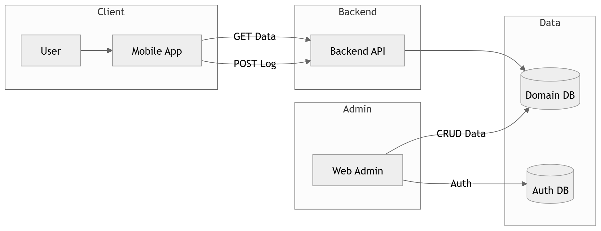
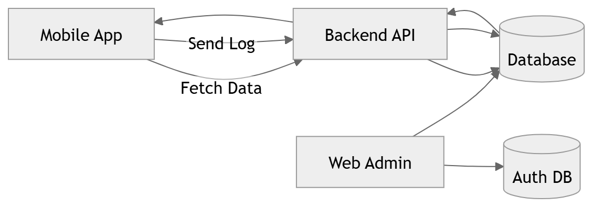
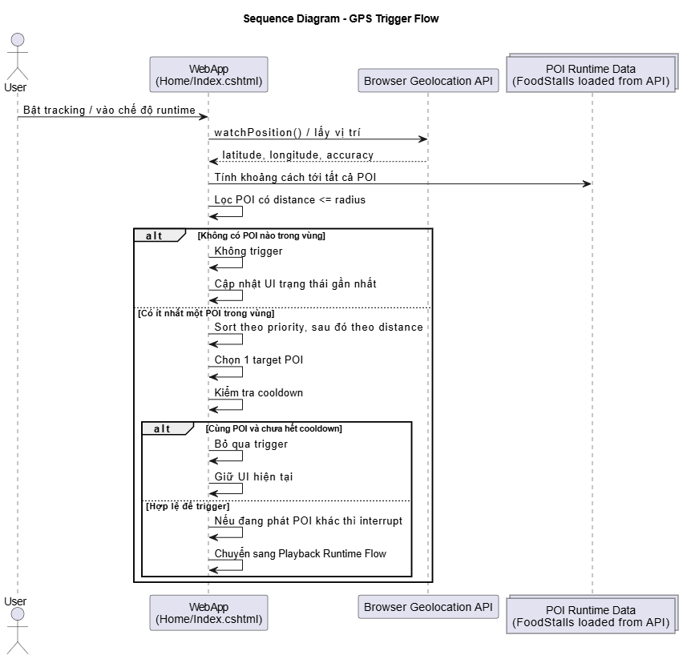
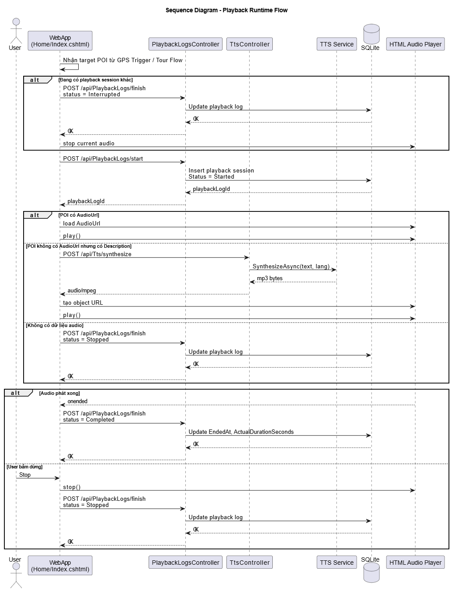
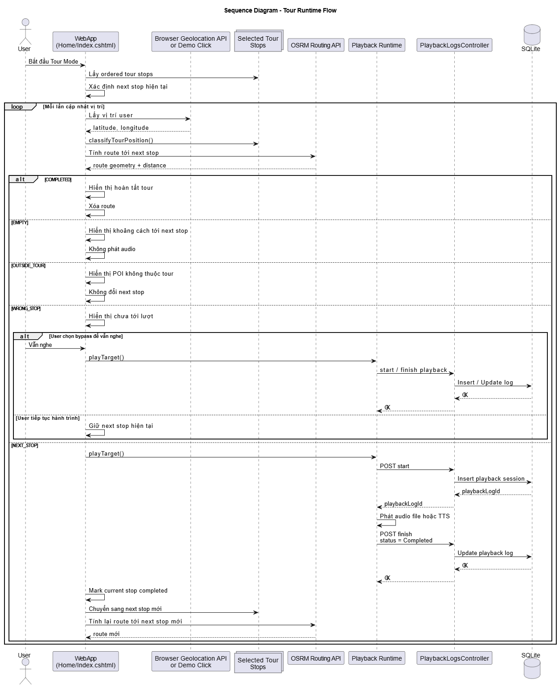
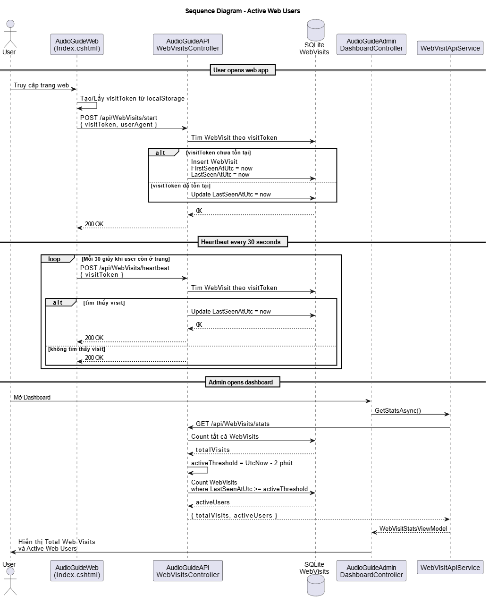

# PRD - Hệ thống Audio Guide Phố Ẩm Thực Vĩnh Khánh

## 1. Giới thiệu sản phẩm

### 1.1. Tên sản phẩm

**Audio Guide Phố Ẩm Thực Vĩnh Khánh**

---

### 1.2. Mô tả bài toán

Phố Ẩm Thực Vĩnh Khánh tập trung nhiều quán ăn đặc trưng, nhưng trải nghiệm khám phá của du khách hiện vẫn phụ thuộc nhiều vào việc tự tìm kiếm thông tin hoặc đọc nội dung thủ công. Điều này làm cho quá trình tham quan bị rời rạc, thiếu tính dẫn dắt và khó tạo được trải nghiệm số liền mạch tại điểm đến.

Hệ thống được xây dựng nhằm giải quyết bài toán cung cấp nội dung giới thiệu địa điểm theo ngữ cảnh vị trí thực tế của người dùng. Khi người dùng di chuyển đến gần một quán ăn hoặc một điểm quan tâm, hệ thống sẽ tự động phát nội dung thuyết minh bằng âm thanh mà không yêu cầu người dùng thao tác nhiều.

---

### 1.3. Mục tiêu sản phẩm
| Mã | Mục tiêu | Diễn giải |
|---|---|---|
| G1 | Tự động phát thuyết minh theo vị trí | Phát audio khi người dùng đi vào vùng kích hoạt |
| G2 | Hỗ trợ khám phá địa điểm | Hiển thị danh sách quán, bản đồ và thông tin chi tiết |
| G3 | Hỗ trợ đa ngôn ngữ | Nội dung hiển thị theo ngôn ngữ được chọn |
| G4 | Hỗ trợ tour nhiều điểm | Người dùng có thể tham gia tour |
| G5 | Hỗ trợ quản trị nội dung | Admin quản lý dữ liệu và theo dõi log |
| G6 | Kiến trúc dễ mở rộng | Hỗ trợ mở rộng dữ liệu và tính năng |

---

### 1.4. Giá trị mang lại

| Nhóm | Nội dung |
|---|---|
| Trải nghiệm | Giảm thao tác, tăng tính tự nhiên |
| Nội dung | Audio thuyết minh theo vị trí |
| Vận hành | Quản lý dữ liệu tập trung |
| Kỹ thuật | Kiến trúc tách lớp rõ ràng |

---

### 1.5. Định hướng phiên bản hiện tại

Trong phiên bản hiện tại:

- Web App (ASP.NET MVC + JavaScript) là runtime chính
- Toàn bộ logic GPS, trigger và playback được xử lý trên client (browser)
- Backend API chỉ xử lý:
  - cung cấp dữ liệu
  - xử lý TTS
  - ghi nhận log
- Web Admin được tích hợp một phần qua API (hybrid architecture)

Các thay đổi quan trọng:

- Không còn Mobile App runtime
- Web App sử dụng Leaflet + Browser Geolocation API
- Admin bắt đầu chuyển sang gọi API thay vì truy cập DB trực tiếp

---

## 2. Phạm vi và mục tiêu triển khai

### 2.1. Phạm vi chức năng

| Thành phần | Vai trò |
|---|---|
| Web App (ASP.NET MVC + JS) | Map, GPS, trigger, playback |
| Backend API | Cung cấp dữ liệu và lưu log |
| Database (SQLite) | Lưu dữ liệu |
| Web Admin | Quản trị hệ thống |

Web App là thành phần trung tâm xử lý runtime.

---

### 2.2. Phạm vi phiên bản hiện tại

| Nhóm | Nội dung |
|---|---|
| Runtime | GPS + Map + Trigger |
| Playback | Audio file + TTS |
| Data | POI + Translation |
| Logging | Playback session |
| Admin | Dashboard + CRUD |

---

### 2.3. Ngoài phạm vi
| Nội dung | Ghi chú |
|---|---|
| QR trigger | Không sử dụng |
| Streaming realtime | Không cần |
| Recommendation | Không triển khai |

---
### 2.6. Giả định triển khai

| Mã | Giả định |
|---|---|
| A1 | Web App xử lý runtime |
| A2 | Backend chỉ cung cấp dữ liệu |
| A3 | TTS qua API |
| A4 | Audio có thể là file hoặc TTS |
| A5 | Hệ thống chạy trên browser |
---

## 3. Tổng quan hệ thống

### 3.1. Kiến trúc tổng thể

Hệ thống hoạt động theo mô hình client-server.

Luồng chính:

- Web App gọi API để lấy dữ liệu
- Web App lấy vị trí người dùng
- Xác định POI phù hợp
- Phát audio (file hoặc TTS)
- Gửi playback log về backend

---

### 3.2. Thành phần hệ thống

| Thành phần | Công nghệ | Vai trò |
|---|---|---|
| Web App | ASP.NET MVC + JS | Runtime |
| API | ASP.NET Core | Data + log |
| Database | SQLite | Storage |
| Admin | ASP.NET MVC | Quản trị |

---

### 3.6. Kiến trúc logic

| Layer | Logic |
|---|---|
| Web App | GPS, trigger, playback |
| API | Data + TTS + logging |
| Admin | CRUD + dashboard |
| DB | Storage |

----
## 3.7. Minh họa cấu trúc hệ thống và luồng dữ liệu
### 3.7.1. Sơ đồ cấu trúc hệ thống
sơ đồ kiến trúc tổng thể hệ thống



### 3.7.2. Sơ đồ luồng dữ liệu mức tổng quan
sơ đồ  luồng dữ liệu mức độ tổng quan


---

## 4. Actors và phân quyền

### 4.1. Actors chính

| Actor | Mô tả |
|---|---|
| User | Người dùng cuối sử dụng Web App để khám phá địa điểm |
| Admin | Quản trị toàn hệ thống |
| FoodStallOwner | Chủ quán, quản lý thông tin quán của mình |

### 4.2. Quyền truy cập mức cao

| Chức năng | User | Admin | FoodStallOwner |
|---|---:|---:|---:|
| Xem bản đồ và nghe audio | Có | Không áp dụng | Không áp dụng |
| Xem danh sách quán trên Web Admin | Không | Có | Có (chỉ quán của mình) |
| Tạo quán | Không | Có | Không |
| Sửa quán | Không | Có | Có (chỉ quán của mình) |
| Xóa quán | Không | Có | Không |
| Cập nhật translation | Không | Có | Có (chỉ quán của mình) |
| Xem playback logs | Không | Có | Có |
| Quản lý user | Không | Có | Không |

### 4.3. Ghi chú phân quyền hiện tại

Hệ thống Web Admin hiện sử dụng `ASP.NET Core Identity` kết hợp role-based authorization. Hai vai trò hiện có trong hệ thống là:

- `Admin`
- `FoodStallOwner`

Trong đó:

- `Admin` có quyền thực hiện các thao tác tạo, cập nhật, xóa và quản lý user.
- `FoodStallOwner` có quyền truy cập các màn hình xem dữ liệu như dashboard, danh sách quán, danh sách tour và playback logs và chỉ được phép chỉnh sửa dữ liệu của quán họ.

### Quy tắc ownership
- Mỗi FoodStall có thể được gán cho một `FoodStallOwner`
- Quan hệ được lưu bằng `OwnerUserId`
- Một owner có thể quản lý nhiều quán
- Owner chỉ có quyền truy cập và chỉnh sửa quán thuộc về mình
- Admin có thể gán hoặc thay đổi owner của quán


---
## 5. Luồng nghiệp vụ chính

Phần này mô tả các luồng nghiệp vụ cốt lõi của hệ thống.

Trong phiên bản hiện tại:
- Web App đóng vai trò runtime chính
- Backend API cung cấp dữ liệu và ghi nhận playback logs
- Toàn bộ logic GPS, trigger và playback được xử lý trên client (browser)

---

## 5.1. GPS Trigger Flow

### 5.1.1. Mục tiêu

GPS Trigger Flow xác định POI phù hợp dựa trên vị trí người dùng và kích hoạt nội dung audio tương ứng.

Flow này là lõi của hệ thống, quyết định:
- khi nào phát audio
- phát nội dung của quán nào
- chuyển đổi giữa các quán

---

### 5.1.2. Tiền điều kiện

| Mã | Điều kiện |
|---|---|
| P1 | Web App đã tải danh sách POI từ API |
| P2 | Người dùng cho phép truy cập vị trí hoặc dùng Demo Mode |
| P3 | Mỗi POI có `Latitude`, `Longitude`, `Radius`, `Priority` |
| P4 | App đang ở trạng thái theo dõi vị trí |

---

### 5.1.3. Dữ liệu đầu vào

| Dữ liệu | Nguồn |
|---|---|
| Vị trí người dùng | Browser GPS / Demo Mode |
| Danh sách POI | Backend API |
| Radius | Domain data |
| Priority | Domain data |

---

### 5.1.4. Luồng chính

| Bước | Mô tả |
|---|---|
| 1 | Lấy vị trí user |
| 2 | Tính khoảng cách đến tất cả POI |
| 3 | Lọc POI trong vùng (`distance <= radius`) |
| 4 | Nếu không có → không trigger |
| 5 | Nếu có nhiều → sort theo priority + distance |
| 6 | Chọn 1 POI |
| 7 | Kiểm tra cooldown |
| 8 | Nếu hợp lệ → trigger playback |
| 9 | Nếu đang phát → interrupt playback cũ |

### Sơ đồ Sequence - GPS Trigger Flow

Sơ đồ dưới đây mô tả cách Web App lấy vị trí người dùng, tính khoảng cách tới các POI, áp dụng radius, priority và cooldown để xác định địa điểm phù hợp trước khi chuyển sang bước playback.



*Hình: Sequence diagram cho GPS Trigger Flow.*
---

### 5.1.5. Quy tắc chọn POI

- Ưu tiên theo:
  1. Priority
  2. Distance
- Chỉ chọn **1 POI duy nhất**

---

### 5.1.6. Cooldown Logic

- Lưu:
  - POI vừa phát
  - thời điểm phát

- Nếu:
  - cùng POI
  - chưa qua cooldown

→ không phát lại

---

### 5.1.7. Interrupt Logic

Khi chuyển POI:

| Trạng thái | Hành vi |
|---|---|
| Đang phát A | dừng A |
| A | status = Interrupted |
| B | phát ngay |

---

### 5.1.8. Demo Mode

Demo Mode cho phép:
- click trực tiếp trên bản đồ để đặt vị trí

Dùng cùng logic GPS thật

---

### 5.1.9. Output

- POI được chọn chính xác
- Playback được kích hoạt
- Không phát trùng
- Chuyển đổi mượt giữa POI

---

### 5.1.10. Ghi chú kỹ thuật

Triển khai tại:
`AudioGuideWeb/Views/Home/Index.cshtml`

Các hàm:
- resolveTarget()
- shouldSkipTrigger()
- playTarget()
- interruptActivePlaybackIfAny()

---

## 5.2. Playback Runtime Flow

### 5.2.1. Mục tiêu

Quản lý toàn bộ quá trình phát audio:

- start playback
- phát nội dung
- finish / stop / interrupt
- gửi log về backend

---

### 5.2.2. Luồng chính

| Bước | Mô tả |
|---|---|
| 1 | Nhận POI từ GPS |
| 2 | Interrupt nếu đang phát |
| 3 | Gọi API start |
| 4 | Phát audio |
| 5 | Khi kết thúc → gọi finish |

### Sơ đồ Sequence - Playback Runtime Flow

Sơ đồ dưới đây mô tả vòng đời của một playback session, từ khi Web App tạo session, chọn nguồn audio (file hoặc TTS), phát nội dung, cho đến khi hoàn tất hoặc bị dừng/gián đoạn và gửi trạng thái cuối về backend.



*Hình: Sequence diagram cho Playback Runtime Flow.*
---

### 5.2.3. Cơ chế chọn audio

| Trường hợp | Hành vi |
|---|---|
| Có AudioUrl | phát file |
| Không có | gọi API TTS |

---

### 5.2.4. TTS Flow (cập nhật)

| Bước | Mô tả |
|---|---|
| 1 | Web App gọi `/api/Tts/synthesize` |
| 2 | Backend gọi ElevenLabs |
| 3 | Trả về mp3 |
| 4 | Web App phát audio |

---

### 5.2.5. Trạng thái playback

| Status | Mô tả |
|---|---|
| Playing | đang phát |
| Completed | phát xong |
| Stopped | user dừng |
| Interrupted | bị POI khác ngắt |

---

### 5.2.6. Stop Logic

- User bấm dừng → status = Stopped

---

### 5.2.7. Finish Logic

- Audio kết thúc → status = Completed

---

### 5.2.8. Duration

```text
ActualDurationSeconds = EndTime - StartTime
```
---
### 5.2.9. Output

| Kết quả | Mô tả |
|---|---|
| Audio phát thành công | Nội dung POI được phát |
| Playback session được cập nhật | Có trạng thái cuối |
| Thời gian nghe được ghi nhận | Dùng cho analytics |

---

### 5.2.10. Ghi chú kỹ thuật

Logic được triển khai tại:  
`AudioGuideWeb/Views/Home/Index.cshtml`

Các thành phần chính:
- `audioPlayer` → phát audio
- `fetch /api/Tts/synthesize` → lấy audio động từ backend
- Playback session logic → quản lý trạng thái start/finish/interrupted

---

## Tổng kết runtime flow

| Thành phần | Vai trò |
|---|---|
| Web App | Xử lý runtime logic (GPS, trigger, playback) |
| Backend API | Cung cấp dữ liệu, TTS và ghi nhận log |
| Database | Lưu trữ playback logs và dữ liệu domain |

---

### Kết luận

GPS Trigger Flow và Playback Runtime Flow là hai luồng cốt lõi của hệ thống, quyết định trực tiếp trải nghiệm người dùng.  

Web App đóng vai trò trung tâm trong việc:
- xác định vị trí người dùng  
- chọn POI phù hợp  
- điều khiển playback  

Trong khi Backend API đảm nhiệm:
- cung cấp dữ liệu  
- xử lý TTS  
- ghi nhận hành vi người dùng  

Sự kết hợp này tạo nên một hệ thống có khả năng hoạt động tự động, phản hồi theo vị trí và dễ mở rộng trong tương lai.

---

### 5.3. Tour Runtime Flow (Cập nhật)

#### 5.3.1. Mục tiêu

Tour Runtime Flow mô tả cách hệ thống dẫn dắt người dùng theo một lộ trình gồm nhiều điểm dừng, kết hợp giữa GPS, bản đồ và logic phân loại vị trí để tạo trải nghiệm khám phá có định hướng.

Khác với GPS Trigger Flow thông thường, Tour Runtime không chỉ dựa trên khoảng cách mà còn dựa trên trạng thái hành trình (progression state) của người dùng.

---

#### 5.3.2. Khái niệm cốt lõi

| Khái niệm | Mô tả |
|---|---|
| Next Stop | Điểm dừng tiếp theo trong tour |
| Completed Stops | Các điểm đã hoàn thành |
| Current Context | Trạng thái vị trí hiện tại của user |
| Route | Tuyến đường từ vị trí user tới next stop |

---

#### 5.3.3. Phân loại vị trí (Core Logic)

Tại mỗi thời điểm, hệ thống phân loại vị trí người dùng thành 1 trong 4 trạng thái:

| Type | Mô tả |
|---|---|
| EMPTY | Không nằm trong POI nào |
| OUTSIDE_TOUR | Nằm trong POI nhưng không thuộc tour |
| WRONG_STOP | Nằm trong POI thuộc tour nhưng chưa tới lượt |
| NEXT_STOP | Nằm trong POI đúng chặng tiếp theo |

---

#### 5.3.4. Luồng xử lý chính

| Bước | Mô tả |
|---|---|
| 1 | Lấy vị trí user (GPS hoặc Demo Mode) |
| 2 | Xác định `Next Stop` |
| 3 | Phân loại vị trí bằng `classifyTourPosition` |
| 4 | Xử lý theo từng loại trạng thái |
| 5 | Cập nhật UI (status overlay) |
| 6 | Nếu cần → trigger playback |
| 7 | Sau khi playback hoàn tất → cập nhật progress |
| 8 | Cập nhật route tới chặng tiếp theo |

### Sơ đồ Sequence - Tour Runtime Flow

Sơ đồ dưới đây mô tả cách hệ thống xử lý vị trí người dùng trong Tour Mode, phân loại trạng thái hiện tại, cập nhật route, trigger playback đúng chặng và chuyển tiến độ sang điểm dừng tiếp theo sau khi hoàn tất.



---

#### 5.3.5. Hành vi theo từng trạng thái

##### EMPTY
- Hiển thị khoảng cách tới next stop
- Vẽ route tới next stop
- Không phát audio

##### OUTSIDE_TOUR
- Hiển thị thông báo “không thuộc hành trình”
- Không thay đổi next stop
- Không phát audio

##### WRONG_STOP
- Hiển thị “chưa tới lượt”
- Cho phép:
  - tiếp tục hành trình
  - hoặc nghe nội dung (bypass)
- Không thay đổi next stop

##### NEXT_STOP
- Trigger playback
- Sau khi hoàn tất:
  - đánh dấu completed
  - chuyển sang next stop mới
  - cập nhật route

---

#### 5.3.6. Route Navigation

Trong Tour Mode, hệ thống hiển thị route từ vị trí user tới next stop:

| Thành phần | Mô tả |
|---|---|
| Routing engine | OSRM (profile foot) |
| Update condition | Khi user di chuyển > 30m |
| Output | Polyline trên map |
| Distance | Hiển thị theo route (không phải đường thẳng) |

---

#### 5.3.7. Demo Mode

Demo Mode cho phép:
- click bản đồ để giả lập vị trí
- sử dụng cùng logic classification như GPS

Mục đích:
- test logic tour
- demo hệ thống khi không có GPS thật

---

#### 5.3.8. GPS Mode

Trong GPS Mode:
- vị trí được lấy từ browser
- hệ thống tự động:
  - phân loại vị trí
  - cập nhật route
  - trigger audio

---

#### 5.3.9. Output

| Kết quả | Mô tả |
|---|---|
| Hướng dẫn theo lộ trình | User được dẫn dắt theo tour |
| Trải nghiệm tương tác | Hệ thống phản hồi theo ngữ cảnh |
| Route trực quan | Hiển thị đường đi |
| Playback chính xác | Không phát sai thứ tự |

---

### 5.4. Data Retrieval Flow cho Web App

#### 5.4.1. Mục tiêu

Luồng này mô tả cách Web App tải dữ liệu nền từ backend để phục vụ GPS Trigger, playback, tour và hiển thị giao diện. Đây là luồng hỗ trợ nền nhưng có vai trò quyết định trong việc Web App có đủ dữ liệu để hoạt động chính xác hay không.

#### 5.4.2. Mô tả luồng chính

| Bước | Mô tả |
|---|---|
| 1 | Web App khởi động hoặc người dùng vào màn hình cần dữ liệu |
| 2 | Web App gọi `GET /api/Languages` để lấy danh sách ngôn ngữ hỗ trợ |
| 3 | Web App xác định ngôn ngữ đang dùng |
| 4 | Web App gọi `GET /api/FoodStalls?lang=...` để lấy danh sách địa điểm theo ngôn ngữ |
| 5 | Backend chọn translation phù hợp theo ngôn ngữ yêu cầu hoặc fallback sang default language |
| 6 | Web App nhận dữ liệu `FoodStallMobileDto` để dùng cho danh sách, bản đồ, popup và GPS trigger |
| 7 | Nếu người dùng vào chức năng tour, Web App gọi `GET /api/Tours` để lấy dữ liệu tour active |

#### 5.4.3. Quy tắc nghiệp vụ liên quan

| Mã | Quy tắc |
|---|---|
| R1 | Dữ liệu trả về cho Web App chỉ bao gồm các `FoodStall` đang active |
| R2 | API food stall hỗ trợ query `lang` để chọn bản dịch |
| R3 | Nếu không có translation theo ngôn ngữ yêu cầu, backend fallback sang default language |
| R4 | API ngôn ngữ trả danh sách ngôn ngữ hỗ trợ kèm thông tin hiển thị |
| R5 | API tours hiện trả các tour đang active |

---

### 5.5. Admin Management Flow

#### 5.5.1. Mục tiêu

Admin Management Flow mô tả cách Web Admin quản lý dữ liệu nghiệp vụ của hệ thống. Luồng này phục vụ vận hành nội dung và bảo đảm dữ liệu được duy trì nhất quán để mobile app có thể sử dụng.

#### 5.5.2. Nhóm chức năng quản trị chính

| Nhóm chức năng | Mô tả |
|---|---|
| Quản lý quán ăn | Tạo, sửa, xóa, lọc, tìm kiếm và cập nhật translation cho quán |
| Quản lý tour | Tạo, sửa, xóa, xem chi tiết tour và sắp thứ tự điểm dừng |
| Quản lý playback logs | Xem lịch sử phát theo bộ lọc |
| Dashboard | Theo dõi số liệu tổng quan và recent activity |
| Quản lý user admin | Tạo người dùng và gán role |

#### 5.5.3. Mô tả luồng quản lý quán ăn

| Bước | Mô tả |
|---|---|
| 1 | Admin đăng nhập vào Web Admin |
| 2 | Admin truy cập danh sách quán ăn |
| 3 | Admin có thể tìm kiếm theo tên hoặc địa chỉ, lọc theo trạng thái active/inactive |
| 4 | Khi tạo quán mới, admin nhập dữ liệu vị trí và thông tin vận hành cơ bản |
| 5 | Sau khi lưu quán, admin tiếp tục cập nhật translation cho tiếng Việt và tiếng Anh |
| 6 | Dữ liệu sau khi lưu sẽ được dùng chung cho API và mobile app |

#### 5.5.4. Mô tả luồng quản lý tour

| Bước | Mô tả |
|---|---|
| 1 | Admin truy cập danh sách tour |
| 2 | Admin tạo hoặc chỉnh sửa tour |
| 3 | Admin nhập thông tin dịch cho tiếng Việt và tiếng Anh |
| 4 | Admin chọn các quán thuộc tour |
| 5 | Admin sắp thứ tự các điểm bằng `OrderIndex` |
| 6 | Sau khi lưu, tour có thể được mobile app truy xuất nếu đang active |

#### 5.5.5. Mô tả luồng quản lý người dùng

| Bước | Mô tả |
|---|---|
| 1 | Admin truy cập màn hình người dùng |
| 2 | Admin tạo tài khoản mới |
| 3 | Admin gán role là `Admin` hoặc `FoodStallOwner` |
| 4 | Người dùng mới có thể đăng nhập Web Admin với quyền tương ứng |

#### 5.5.6. Quy tắc nghiệp vụ liên quan

| Mã | Quy tắc |
|---|---|
| R1 | `Admin` có quyền tạo, sửa, xóa dữ liệu nghiệp vụ |
| R2 | `FoodStallOwner` chỉ được chỉnh sửa quán và translation thuộc quyền sở hữu của mình |
| R3 | Translation của quán và tour hiện được quản lý tối thiểu cho tiếng Việt và tiếng Anh |
| R4 | Web Admin hiện sử dụng kiến trúc hybrid: một số module đọc/ghi trực tiếp domain database, một số module gọi Backend API |
| R5 | Auth data của Web Admin được lưu riêng với domain data |

---
## 5.6. Web Visit Tracking Flow

### Mục tiêu

Theo dõi số lượng người dùng truy cập Web App và số lượng user đang active.

Sơ đồ dưới đây mô tả chi tiết luồng hoạt động của hệ thống theo dõi người dùng truy cập và active users.

---

### Luồng hoạt động

| Bước | Mô tả |
|---|---|
| 1 | Khi load trang → gọi `/api/WebVisits/start` |
| 2 | Gửi `visitToken` (UUID) |
| 3 | Backend tạo hoặc update record |
| 4 | Mỗi 30s → gọi `/api/WebVisits/heartbeat` |
| 5 | Backend update `LastSeenAtUtc` |
| 6 | Dashboard gọi `/api/WebVisits/stats` |

---

### Output

| Metric | Mô tả |
|---|---|
| totalVisits | tổng số session |
| activeUsers | user hoạt động gần đây |

---

### Ghi chú

- Active threshold: 2 phút
- Token lưu bằng localStorage
---
### 5.7. Tổng kết các luồng nghiệp vụ cốt lõi

| Luồng | Vai trò | Thành phần tham gia chính |
|---|---|---|
| GPS Trigger Flow | Kích hoạt nội dung theo vị trí | Web App, Domain data |
| Playback Flow | Ghi nhận vòng đời playback session | Web App, Backend API, Domain Database |
| Tour Flow | Hỗ trợ trải nghiệm theo lộ trình | Web App, Backend API, Domain data |
| Data Retrieval Flow | Tải dữ liệu nền cho runtime | Web App, Backend API |
| Admin Management Flow | Quản trị và vận hành hệ thống | Web Admin, Backend API, Domain Database, Auth Database |
| Web Visit Tracking Flow | Theo dõi lượt truy cập và active users | Web App, Backend API, Domain Database |

Các luồng trên tạo thành xương sống nghiệp vụ của hệ thống. Trong đó, GPS Trigger Flow, Playback Flow và Tour Flow là ba luồng trực tiếp tạo ra trải nghiệm cho người dùng cuối trên Web App, còn Admin Management Flow và Web Visit Tracking Flow hỗ trợ vận hành, giám sát và demo hệ thống.

---

## 6. Yêu cầu chức năng (Functional Requirements)

Phần này mô tả các chức năng mà hệ thống phải cung cấp. Các yêu cầu được phân tách theo từng thành phần chính trong kiến trúc: Mobile App, Backend API và Web Admin.

Các yêu cầu được xây dựng dựa trên hệ thống hiện tại và bám sát implementation trong code.

---

### 6.1. Web App

Web App là thành phần trực tiếp tương tác với người dùng cuối, chịu trách nhiệm hiển thị dữ liệu, xử lý GPS, trigger playback và theo dõi web visit.

#### 6.1.1. Quản lý dữ liệu địa điểm

| Mã | Chức năng | Mô tả |
|---|---|---|
| W-F1 | Tải danh sách địa điểm | Web App gọi API để lấy danh sách `FoodStall` đang hoạt động |
| W-F2 | Hiển thị thông tin địa điểm | Hiển thị tên, địa chỉ, mô tả, specialty, giá |
| W-F3 | Hiển thị vị trí trên bản đồ | Sử dụng latitude/longitude để hiển thị POI |
| W-F4 | Hiển thị hình ảnh | Hiển thị ảnh từ `ImageUrl` |
| W-F5 | Hỗ trợ link bản đồ | Cho phép mở `MapLink` nếu có |

#### 6.1.2. Xử lý GPS và trigger

| Mã | Chức năng | Mô tả |
|---|---|---|
| W-F6 | Lấy vị trí người dùng | Sử dụng Browser Geolocation API |
| W-F7 | Tính khoảng cách tới POI | So sánh vị trí user với danh sách POI |
| W-F8 | Xác định vùng kích hoạt | So sánh khoảng cách với `Radius` |
| W-F9 | Chọn POI phù hợp | Chọn POI theo `Priority` và `Distance` |
| W-F10 | Kích hoạt audio tự động | Khi vào vùng kích hoạt, tự động phát audio |

#### 6.1.3. Playback audio

| Mã | Chức năng | Mô tả |
|---|---|---|
| W-F11 | Phát audio | Phát nội dung từ `AudioUrl` hoặc TTS |
| W-F12 | Quản lý trạng thái playback | Theo dõi start, completed, stopped, interrupted |
| W-F13 | Tránh phát trùng | Không phát lại liên tục cùng một POI trong thời gian ngắn |

#### 6.1.4. Gửi playback log

| Mã | Chức năng | Mô tả |
|---|---|---|
| W-F14 | Start playback session | Gọi API `/api/PlaybackLogs/start` |
| W-F15 | Finish playback session | Gọi API `/api/PlaybackLogs/finish` |
| W-F16 | Tính thời gian nghe thực tế | Dựa trên thời gian runtime |

#### 6.1.5. Quản lý ngôn ngữ

| Mã | Chức năng | Mô tả |
|---|---|---|
| W-F17 | Tải danh sách ngôn ngữ | Gọi API `/api/Languages` |
| W-F18 | Chọn ngôn ngữ nội dung | Người dùng chọn ngôn ngữ |
| W-F19 | Áp dụng ngôn ngữ | Gửi `lang` lên API khi lấy dữ liệu |
| W-F20 | Fallback ngôn ngữ | Sử dụng default language nếu thiếu translation |

#### 6.1.6. Tour

| Mã | Chức năng | Mô tả |
|---|---|---|
| W-F21 | Tải danh sách tour | Gọi API `/api/Tours` |
| W-F22 | Hiển thị tour | Hiển thị tên và mô tả tour |
| W-F23 | Tham gia tour | Người dùng chọn tour |
| W-F24 | Điều hướng theo tour | Web App dùng danh sách stop và route |
| W-F25 | Phát audio theo tour | Trigger audio theo đúng chặng tiếp theo |

#### 6.1.7. Web visit tracking

| Mã | Chức năng | Mô tả |
|---|---|---|
| W-F26 | Tạo visit session | Gọi `/api/WebVisits/start` khi tải trang |
| W-F27 | Gửi heartbeat | Gọi `/api/WebVisits/heartbeat` định kỳ |

---

### 6.2. Backend API

Backend API chịu trách nhiệm cung cấp dữ liệu và ghi nhận hành vi người dùng.

#### 6.2.1. FoodStall API

| Mã | Endpoint | Mô tả |
|---|---|---|
| B-F1 | GET /api/FoodStalls | Trả danh sách địa điểm |
| B-F2 | GET /api/FoodStalls/{id} | Trả chi tiết một địa điểm |
| B-F3 | Lọc theo trạng thái | Chỉ trả `IsActive = true` |
| B-F4 | Hỗ trợ đa ngôn ngữ | Nhận query `lang` |
| B-F5 | Fallback translation | Dùng default language nếu thiếu |
| B-F6 | Sắp xếp theo priority | Order theo `Priority` |
| B-F7 | Trả DTO cho mobile | Sử dụng `FoodStallMobileDto` |

---

#### 6.2.2. Language API

| Mã | Endpoint | Mô tả |
|---|---|---|
| B-F8 | GET /api/Languages | Trả danh sách ngôn ngữ |
| B-F9 | Xác định default language | Dựa vào `IsDefault` |

---

#### 6.2.3. PlaybackLog API

| Mã | Endpoint | Mô tả |
|---|---|---|
| B-F10 | POST /api/PlaybackLogs/start | Tạo playback session mới |
| B-F11 | POST /api/PlaybackLogs/finish | Kết thúc playback session |
| B-F12 | Lưu thời gian server | Sử dụng `DateTime.UtcNow` |
| B-F13 | Validate request | Trả lỗi nếu request không hợp lệ |

---

#### 6.2.4. Tour API

| Mã | Endpoint | Mô tả |
|---|---|---|
| B-F14 | GET /api/Tours | Trả danh sách tour |
| B-F15 | Lọc tour active | Chỉ trả `IsActive = true` |
| B-F16 | Bao gồm tour items | Trả danh sách điểm |
| B-F17 | Bao gồm translation | Trả dữ liệu đa ngôn ngữ |

---

### 6.3. Web Admin

Web Admin là công cụ quản trị dữ liệu và giám sát hệ thống.

---

#### 6.3.1. Xác thực và phân quyền

| Mã | Chức năng | Mô tả |
|---|---|---|
| A-F5 | Xem danh sách quán | Admin thấy tất cả, Owner chỉ thấy quán của mình |
| A-F6 | Tạo quán | Chỉ Admin |
| A-F7 | Sửa quán | Admin sửa tất cả, Owner chỉ sửa quán của mình |
| A-F8 | Xóa quán | Chỉ Admin |
| A-F9 | Quản lý translation | Admin và Owner (chỉ quán của mình) |
| A-F10 | Gán owner cho quán | Admin chọn owner khi tạo/sửa |

---

#### 6.3.2. Quản lý FoodStall

| Mã | Chức năng | Mô tả |
|---|---|---|
| A-F5 | Xem danh sách quán | Có tìm kiếm và filter |
| A-F6 | Tạo quán | Nhập thông tin vị trí và metadata |
| A-F7 | Sửa quán | Cập nhật dữ liệu |
| A-F8 | Xóa quán | Xóa khỏi hệ thống |
| A-F9 | Quản lý translation | Edit tiếng Việt và tiếng Anh |

---

#### 6.3.3. Quản lý Tour

| Mã | Chức năng | Mô tả |
|---|---|---|
| A-F10 | Xem danh sách tour | Có tìm kiếm |
| A-F11 | Tạo tour | Nhập translation và danh sách điểm |
| A-F12 | Sửa tour | Cập nhật thông tin |
| A-F13 | Xóa tour | Xóa khỏi hệ thống |
| A-F14 | Sắp xếp điểm | Dùng `OrderIndex` |

---

#### 6.3.4. Playback Logs 

Playback Logs trong Web Admin cho phép theo dõi các playback session được tạo từ Web App.

Ở đây, mỗi bản ghi đại diện cho một **playback session hoàn chỉnh**, thay vì chỉ một lần phát đơn giản.

---

##### Thông tin hiển thị

| Trường | Mô tả |
|---|---|
| Food Stall | POI được phát |
| Language | Ngôn ngữ sử dụng |
| Trigger Type | GPS / DEMO / TOUR |
| Status | Trạng thái session |
| StartedAt | Thời điểm bắt đầu |
| EndedAt | Thời điểm kết thúc |
| ActualDurationSeconds | Thời gian nghe thực tế |

---

##### Chức năng

| Chức năng | Mô tả |
|---|---|
| Xem danh sách session | Hiển thị toàn bộ playback logs |
| Lọc theo ngôn ngữ | vi / en |
| Lọc theo trigger type | GPS / DEMO / TOUR |
| Lọc theo status | Completed / Stopped / Interrupted |
| Tìm kiếm theo POI | Tên hoặc địa chỉ |

---

##### Vai trò

Playback Logs đóng vai trò:
- kiểm thử hệ thống
- theo dõi hành vi người dùng
- cung cấp dữ liệu cho dashboard

---

#### 6.3.5. Dashboard

| Mã | Chức năng | Mô tả |
|---|---|---|
| A-F18 | Hiển thị tổng số quán | Tổng và active |
| A-F19 | Hiển thị tổng playback sessions | Playback logs |
| A-F20 | Thống kê theo trigger | GPS, DEMO, TOUR |
| A-F21 | Thống kê theo ngôn ngữ | vi, en |
| A-F22 | Thống kê theo status | Completed, Stopped, Interrupted |
| A-F23 | Hiển thị total actual listening time | Tổng thời gian nghe thực tế |
| A-F24 | Recent logs | 5 log gần nhất |
| A-F25 | Top food stalls | Theo số lượt phát |
| A-F26 | Hiển thị tổng Web Visits | Tổng số lượt truy cập web |
| A-F27 | Hiển thị Active Web Users | Số user đang active |

---

#### 6.3.6. Quản lý người dùng

| Mã | Chức năng | Mô tả |
|---|---|---|
| A-F24 | Xem danh sách user | Hiển thị email và role |
| A-F25 | Tạo user | Tạo tài khoản mới |
| A-F26 | Gán role | Admin hoặc FoodStallOwner |
| A-F27 | Validate dữ liệu | Kiểm tra email trùng, role hợp lệ |

---

### 6.4. Tổng kết

| Thành phần | Phạm vi chức năng |
|---|---|
| Web App | Runtime chính cho user cuối |
| Backend API | Cung cấp dữ liệu, TTS, logging, web visit tracking |
| Web Admin | CRUD, monitoring, dashboard, user management |

Các yêu cầu chức năng trên phản ánh đầy đủ khả năng hiện tại của hệ thống và đóng vai trò làm cơ sở để triển khai, kiểm thử và đánh giá hệ thống.

---

## 7. Quy tắc nghiệp vụ (Business Rules)

Phần này mô tả các quy tắc nghiệp vụ cốt lõi chi phối hành vi của hệ thống. Các quy tắc được rút ra từ thiết kế dữ liệu, logic API và cách hệ thống đang được triển khai thực tế.

---

### 7.1. Quy tắc liên quan đến FoodStall

| Mã | Quy tắc | Mô tả |
|---|---|---|
| BR-FS1 | Chỉ hiển thị quán active | Chỉ các `FoodStall` có `IsActive = true` mới được trả về cho mobile app |
| BR-FS2 | Mỗi quán có tọa độ xác định | Mỗi `FoodStall` phải có `Latitude` và `Longitude` |
| BR-FS3 | Mỗi quán có bán kính kích hoạt | `Radius` xác định vùng GPS trigger (đơn vị mét) |
| BR-FS4 | Priority dùng để sắp thứ tự | Khi có nhiều POI gần nhau, `Priority` được dùng để quyết định thứ tự |
| BR-FS5 | Thông tin hiển thị có thể null | Các trường như `ImageUrl`, `Address`, `PriceRange` có thể không bắt buộc |
| BR-FS6 | MapLink là tùy chọn | Nếu có, app có thể dùng để mở bản đồ ngoài |

---

### 7.2. Quy tắc đa ngôn ngữ

| Mã | Quy tắc | Mô tả |
|---|---|---|
| BR-L1 | Mỗi language có mã duy nhất | `LanguageCode` là duy nhất |
| BR-L2 | Có một default language | Hệ thống phải có đúng một language với `IsDefault = true` |
| BR-L3 | Mỗi quán chỉ có một translation cho mỗi language | Unique `(FoodStallId, LanguageId)` |
| BR-L4 | Mỗi tour chỉ có một translation cho mỗi language | Unique `(TourId, LanguageId)` |
| BR-L5 | API hỗ trợ chọn ngôn ngữ | Thông qua query `lang` |
| BR-L6 | Có fallback ngôn ngữ | Nếu không có translation theo `lang`, dùng default language |
| BR-L7 | Language dùng cho UI | `DisplayName`, `FlagIcon`, `IntroText` phục vụ hiển thị |

---

### 7.3. Quy tắc liên quan đến Translation

| Mã | Quy tắc | Mô tả |
|---|---|---|
| BR-T1 | Name là bắt buộc | `Name` trong translation không được null |
| BR-T2 | Description là tùy chọn | Có thể null |
| BR-T3 | Specialty là tùy chọn | Dùng để mô tả món đặc trưng |
| BR-T4 | AudioUrl là tùy chọn | Có thể null nếu dùng TTS |
| BR-T5 | Translation phụ thuộc entity gốc | Translation không tồn tại độc lập |
| BR-T6 | Xóa cascade | Khi xóa `FoodStall`, các translation bị xóa theo |

---

### 7.4. Quy tắc GPS Trigger

| Mã | Quy tắc | Mô tả |
|---|---|---|
| BR-G1 | Trigger dựa trên khoảng cách | So sánh khoảng cách user với `Radius` |
| BR-G2 | Chỉ trigger với quán active | Không trigger quán inactive |
| BR-G3 | Có thể có nhiều POI cùng lúc | Hệ thống phải chọn 1 POI phù hợp |
| BR-G4 | Priority quyết định chọn POI | POI có priority phù hợp sẽ được chọn |
| BR-G5 | Không trigger liên tục | Cần cơ chế tránh phát lặp lại liên tục |
| BR-G6 | GPS là trigger chính | Phiên bản hiện tại không sử dụng QR |

---

### 7.5. Quy tắc Playback

| Mã | Quy tắc | Mô tả |
|---|---|---|
| BR-P1 | Mỗi playback là một session | Không còn log đơn giản |
| BR-P2 | Playback có trạng thái | Started / Completed / Stopped / Interrupted |
| BR-P3 | Backend ghi thời gian bắt đầu/kết thúc | Sử dụng UTC |
| BR-P4 | Duration là thời gian thực tế | Được tính từ Web App |
| BR-P5 | Playback có thể bị gián đoạn | Khi user chuyển POI |
| BR-P6 | Playback session có trạng thái | Dùng cho monitoring |
| BR-P7 | ActualDuration là dữ liệu chính | Dùng để thống kê |
| BR-P8 | Playback logs phục vụ dashboard | Là nguồn dữ liệu duy nhất |

---

### 7.6. Quy tắc Tour

| Mã | Quy tắc | Mô tả |
|---|---|---|
| BR-TO1 | Chỉ dùng tour active | `IsActive = true` |
| BR-TO2 | Tour phải có ít nhất 1 điểm | Không có điểm thì không hợp lệ |
| BR-TO3 | Không trùng quán trong tour | Unique `(TourId, FoodStallId)` |
| BR-TO4 | Có thứ tự điểm | `OrderIndex` xác định thứ tự |
| BR-TO5 | Có translation cho tour | Tương tự FoodStall |
| BR-TO6 | Tour gồm nhiều FoodStall | Quan hệ 1-N qua `TourItem` |
| BR-TO7 | Tour runtime sử dụng phân loại vị trí | Hệ thống phân loại vị trí thành EMPTY / OUTSIDE_TOUR / WRONG_STOP / NEXT_STOP |
| BR-TO8 | Route luôn hướng tới next stop | Không bị ảnh hưởng bởi interaction sai |
| BR-TO9 | Playback chỉ auto tại NEXT_STOP | Không auto ở các trạng thái khác |
---

### 7.7. Quy tắc Web Admin

#### 7.7.1. Phân quyền

| Mã | Quy tắc | Mô tả |
|---|---|---|
| BR-A1 | Admin toàn quyền | CRUD toàn bộ dữ liệu nghiệp vụ và quản lý user |
| BR-A2 | FoodStallOwner bị giới hạn theo ownership | Chỉ được truy cập và chỉnh sửa dữ liệu quán thuộc quyền sở hữu của mình |
| BR-A3 | Endpoint bảo vệ bằng Authorize | Sử dụng role-based authorization |
| BR-A4 | User phải đăng nhập | Trước khi truy cập Web Admin |

---

#### 7.7.2. Quản lý dữ liệu

| Mã | Quy tắc | Mô tả |
|---|---|---|
| BR-A5 | CRUD FoodStall | Tạo, sửa, xóa |
| BR-A6 | Translation edit riêng | Có màn hình riêng cho translation |
| BR-A7 | Tour quản lý độc lập | Có module riêng |
| BR-A8 | Playback log chỉ đọc | Không chỉnh sửa |
| BR-A9 | Dashboard dùng dữ liệu log | Tính toán từ PlaybackLogs |

---

#### 7.7.3. Quản lý người dùng

| Mã | Quy tắc | Mô tả |
|---|---|---|
| BR-A10 | Email là duy nhất | Không cho tạo trùng |
| BR-A11 | Role phải tồn tại | Validate trước khi gán |
| BR-A12 | User phải có role | Không có role thì không hợp lệ |
| BR-A13 | Password theo policy | Tối thiểu 6 ký tự |

---

### 7.7.4. Quy tắc Ownership

| Mã | Quy tắc | Mô tả |
|---|---|---|
| BR-O1 | FoodStall có thể có owner | Lưu bằng `OwnerUserId` |
| BR-O2 | Owner chỉ thấy quán của mình | Filter tại backend |
| BR-O3 | Owner chỉ sửa quán của mình | Kiểm tra trong controller |
| BR-O4 | Admin toàn quyền | Không bị giới hạn |
| BR-O5 | Owner không được tạo/xóa quán | Chỉ được edit |
| BR-O6 | Owner được edit translation | Nhưng chỉ quán của mình |

---
### 7.8. Quy tắc dữ liệu và hệ thống

| Mã | Quy tắc | Mô tả |
|---|---|---|
| BR-S1 | Domain DB dùng chung | API và Admin cùng dùng domain database |
| BR-S2 | Auth DB tách riêng | Identity dùng DB riêng |
| BR-S3 | Dữ liệu seed khi khởi động | Dùng `DbSeeder` hoặc seeding tương đương |
| BR-S4 | Migration tự động | Chạy khi startup |
| BR-S5 | Logic GPS nằm ở Web App | Runtime GPS, trigger và playback được xử lý phía client browser |

---

### 7.9. Tổng kết

Các Business Rules trên đóng vai trò:

- Định nghĩa hành vi hệ thống
- Đảm bảo tính nhất quán dữ liệu
- Làm cơ sở cho việc kiểm thử
- Giúp tránh sai lệch giữa thiết kế và implementation

Các quy tắc này được rút ra trực tiếp từ:
- thiết kế database
- logic API
- hành vi Web Admin
- và cách hệ thống được triển khai thực tế.

---

## 8. Thiết kế dữ liệu (Data Design)

Phần này mô tả cấu trúc dữ liệu của hệ thống, bao gồm các thực thể chính, mối quan hệ giữa chúng và các ràng buộc dữ liệu. Thiết kế dữ liệu được xây dựng dựa trên Entity Framework Core và lưu trữ bằng SQLite.

---

### 8.1. Tổng quan mô hình dữ liệu

Hệ thống sử dụng mô hình dữ liệu quan hệ với các nhóm thực thể chính:

| Nhóm | Thực thể |
|---|---|
| Địa điểm | `FoodStall`, `FoodStallTranslation` |
| Ngôn ngữ | `Language` |
| Tour | `Tour`, `TourItem`, `TourTranslation` |
| Playback | `PlaybackLog` |
| Quản trị | `ApplicationUser`, `IdentityRole` |

Mô hình được thiết kế theo hướng:
- tách dữ liệu nội dung và dữ liệu đa ngôn ngữ
- đảm bảo khả năng mở rộng thêm ngôn ngữ
- hỗ trợ quản lý quan hệ giữa các thực thể

- `OwnerUserId` không phải foreign key vật lý
- mapping thực hiện ở tầng application
---

### 8.2. Sơ đồ quan hệ dữ liệu

**[TODO - Chèn ERD (Entity Relationship Diagram)]**

Gợi ý:
- FoodStall — FoodStallTranslation (1-N)
- Language — FoodStallTranslation (1-N)
- Tour — TourItem (1-N)
- Tour — TourTranslation (1-N)
- FoodStall — TourItem (1-N)
- FoodStall — PlaybackLog (1-N)

**[TODO - Chèn UML Class Diagram]**

---

### 8.3. Thực thể FoodStall

#### 8.3.1. Mô tả

`FoodStall` đại diện cho một địa điểm (quán ăn) trong hệ thống.

#### 8.3.2. Thuộc tính

| Thuộc tính | Kiểu | Mô tả |
|---|---|---|
| Id | int | Khóa chính |
| Latitude | double | Vĩ độ |
| Longitude | double | Kinh độ |
| Radius | double | Bán kính kích hoạt (mét) |
| Priority | int | Độ ưu tiên |
| ImageUrl | string | URL hình ảnh |
| Address | string | Địa chỉ |
| PriceRange | string | Khoảng giá |
| MapLink | string | Link bản đồ |
| IsActive | bool | Trạng thái hoạt động |

#### 8.3.3. Quan hệ

| Quan hệ | Loại |
|---|---|
| FoodStall → FoodStallTranslation | 1 - N |
| FoodStall → PlaybackLog | 1 - N |
| FoodStall → TourItem | 1 - N |

---

### 8.4. Thực thể FoodStallTranslation

#### 8.4.1. Mô tả

Lưu nội dung mô tả của địa điểm theo từng ngôn ngữ.

#### 8.4.2. Thuộc tính

| Thuộc tính | Kiểu | Mô tả |
|---|---|---|
| Id | int | Khóa chính |
| FoodStallId | int | FK tới FoodStall |
| LanguageId | int | FK tới Language |
| Name | string | Tên quán |
| Description | string | Mô tả |
| Specialty | string | Món đặc trưng |
| AudioUrl | string | URL audio |

#### 8.4.3. Ràng buộc

| Ràng buộc | Mô tả |
|---|---|
| Unique (FoodStallId, LanguageId) | Mỗi quán chỉ có 1 translation mỗi ngôn ngữ |

---

### 8.5. Thực thể Language

#### 8.5.1. Mô tả

Lưu danh sách các ngôn ngữ được hỗ trợ trong hệ thống.

#### 8.5.2. Thuộc tính

| Thuộc tính | Kiểu | Mô tả |
|---|---|---|
| Id | int | Khóa chính |
| LanguageCode | string | Mã ngôn ngữ (vi, en) |
| DisplayName | string | Tên hiển thị |
| FlagIcon | string | Icon cờ |
| IntroText | string | Nội dung giới thiệu |
| IsDefault | bool | Ngôn ngữ mặc định |

#### 8.5.3. Ràng buộc

| Ràng buộc | Mô tả |
|---|---|
| LanguageCode unique | Không trùng mã ngôn ngữ |

---

### 8.6. Thực thể PlaybackLog 

#### Thuộc tính

| Thuộc tính | Kiểu | Mô tả |
|---|---|---|
| Id | int | Khóa chính |
| FoodStallId | int | FK tới FoodStall |
| LanguageCode | string | Ngôn ngữ phát |
| TriggerType | string | GPS / DEMO /TOUR|
| Status | string | Started / Completed / Stopped / Interrupted |
| StartedAt | datetime | Thời điểm bắt đầu |
| EndedAt | datetime? | Thời điểm kết thúc |
| ActualDurationSeconds | int | Thời gian nghe thực tế |

#### Ghi chú
- Dữ liệu thời gian được lưu theo UTC

---

### 8.7. Thực thể Tour

#### 8.7.1. Mô tả

Đại diện cho một tour gồm nhiều điểm tham quan.

#### 8.7.2. Thuộc tính

| Thuộc tính | Kiểu | Mô tả |
|---|---|---|
| Id | int | Khóa chính |
| IsActive | bool | Trạng thái |

#### 8.7.3. Quan hệ

| Quan hệ | Loại |
|---|---|
| Tour → TourItem | 1 - N |
| Tour → TourTranslation | 1 - N |

---

### 8.8. Thực thể TourItem

#### 8.8.1. Mô tả

Liên kết giữa Tour và FoodStall, xác định các điểm trong tour.

#### 8.8.2. Thuộc tính

| Thuộc tính | Kiểu | Mô tả |
|---|---|---|
| Id | int | Khóa chính |
| TourId | int | FK tới Tour |
| FoodStallId | int | FK tới FoodStall |
| OrderIndex | int | Thứ tự trong tour |

#### 8.8.3. Ràng buộc

| Ràng buộc | Mô tả |
|---|---|
| Unique (TourId, FoodStallId) | Không lặp lại quán trong tour |

---

### 8.9. Thực thể TourTranslation

#### 8.9.1. Mô tả

Lưu nội dung tour theo từng ngôn ngữ.

#### 8.9.2. Thuộc tính

| Thuộc tính | Kiểu | Mô tả |
|---|---|---|
| Id | int | Khóa chính |
| TourId | int | FK tới Tour |
| LanguageId | int | FK tới Language |
| Name | string | Tên tour |
| Description | string | Mô tả |

#### 8.9.3. Ràng buộc

| Ràng buộc | Mô tả |
|---|---|
| Unique (TourId, LanguageId) | 1 translation mỗi ngôn ngữ |

---

### 8.10. Thực thể ApplicationUser

#### 8.10.1. Mô tả

Đại diện cho người dùng quản trị hệ thống.

#### 8.10.2. Thuộc tính chính

| Thuộc tính | Mô tả |
|---|---|
| Id | ID user |
| Email | Email đăng nhập |
| FullName | Tên đầy đủ |
| PasswordHash | Mật khẩu mã hóa |

#### 8.10.3. Quan hệ

- Thuộc hệ thống Identity
- Gắn với `IdentityRole`

---
### 8.6.11. Thực thể WebVisit

#### Thuộc tính

| Thuộc tính | Kiểu | Mô tả |
|---|---|---|
| Id | int | Khóa chính |
| VisitToken | string | Định danh session phía client |
| FirstSeenAtUtc | datetime | Thời điểm bắt đầu truy cập |
| LastSeenAtUtc | datetime | Thời điểm heartbeat gần nhất |
| UserAgent | string? | Thông tin trình duyệt |
| IpAddress | string? | Địa chỉ IP |

#### Ghi chú

- Dùng để theo dõi tổng số lượt truy cập và số user đang active
- Active user được xác định theo ngưỡng thời gian gần nhất

---
### 8.12. Mối quan hệ tổng thể

| Thực thể A | Thực thể B | Quan hệ |
|---|---|---|
| FoodStall | FoodStallTranslation | 1 - N |
| Language | FoodStallTranslation | 1 - N |
| Tour | TourItem | 1 - N |
| Tour | TourTranslation | 1 - N |
| FoodStall | TourItem | 1 - N |
| FoodStall | PlaybackLog | 1 - N |

---

### 8.13. Đặc điểm thiết kế dữ liệu

| Đặc điểm | Mô tả |
|---|---|
| Hỗ trợ đa ngôn ngữ | Tách bảng translation |
| Dữ liệu chuẩn hóa | Không lặp nội dung giữa các bảng |
| Quan hệ rõ ràng | FK + unique constraint |
| Dễ mở rộng | Có thể thêm ngôn ngữ mới |
| Tách auth và domain | DB riêng cho Identity |

---

### 8.14. Tổng kết

Thiết kế dữ liệu của hệ thống:
- phản ánh đầy đủ domain nghiệp vụ
- hỗ trợ tốt cho đa ngôn ngữ
- đảm bảo tính nhất quán và toàn vẹn dữ liệu
- phù hợp với kiến trúc hiện tại của hệ thống

Mô hình này là nền tảng cho:
- Backend API
- Mobile App
- Web Admin

---
## 9. Thiết kế API (API Design Overview)

## 9. Thiết kế API (API Design Overview)

Phần này mô tả các API chính của hệ thống Backend, bao gồm các endpoint cung cấp dữ liệu cho Web App và endpoint ghi nhận dữ liệu từ phía client.

API được thiết kế theo mô hình RESTful, sử dụng HTTP và JSON làm định dạng trao đổi dữ liệu.

---

### 9.1. Tổng quan

| Thuộc tính | Giá trị |
|---|---|
| Giao thức | HTTP |
| Kiểu API | RESTful |
| Định dạng dữ liệu | JSON |
| Base URL | `/api/...` |
| Xác thực | Không yêu cầu (đối với mobile API hiện tại) |

---

### 9.2. Nhóm API FoodStall

#### 9.2.1. Lấy danh sách địa điểm

- **Endpoint**: `GET /api/FoodStalls`
- **Mô tả**: Trả danh sách các quán ăn đang hoạt động

##### Query Parameters

| Tên | Kiểu | Bắt buộc | Mô tả |
|---|---|---|---|
| lang | string | Không | Mã ngôn ngữ (mặc định: `vi`) |

##### Response

~~~json
[
  {
    "id": 1,
    "name": "Bánh mì A",
    "address": "...",
    "specialty": "...",
    "priceRange": "...",
    "imageUrl": "...",
    "latitude": 10.123,
    "longitude": 106.123,
    "radius": 35,
    "description": "...",
    "audioUrl": "...",
    "priority": 0,
    "mapLink": "...",
    "languageCode": "vi"
  }
]
~~~

##### Ghi chú

- Chỉ trả các `FoodStall` có `IsActive = true`
- Hỗ trợ đa ngôn ngữ với fallback về default language
- Sắp xếp theo `Priority`

---

#### 9.2.2. Lấy chi tiết địa điểm

- **Endpoint**: `GET /api/FoodStalls/{id}`
- **Mô tả**: Trả thông tin chi tiết của một địa điểm

##### Query Parameters

| Tên | Kiểu | Bắt buộc | Mô tả |
|---|---|---|---|
| lang | string | Không | Mã ngôn ngữ |

##### Response

~~~json
{
  "id": 1,
  "name": "...",
  "address": "...",
  "specialty": "...",
  "priceRange": "...",
  "imageUrl": "...",
  "latitude": 10.123,
  "longitude": 106.123,
  "radius": 35,
  "description": "...",
  "audioUrl": "...",
  "priority": 0,
  "mapLink": "...",
  "languageCode": "vi"
}
~~~

---

### 9.3. Nhóm API Language

#### 9.3.1. Lấy danh sách ngôn ngữ

- **Endpoint**: `GET /api/Languages`
- **Mô tả**: Trả danh sách các ngôn ngữ được hỗ trợ

##### Response

~~~json
[
  {
    "languageCode": "vi",
    "displayName": "Tiếng Việt",
    "flagIcon": "/flags/vn.png",
    "introText": "...",
    "isDefault": true
  }
]
~~~

##### Ghi chú

- Ngôn ngữ mặc định được xác định bởi `IsDefault = true`

---

### 9.4. PlaybackLog API

#### 9.4.1. Start playback

- Endpoint: `POST /api/PlaybackLogs/start`

Request:
```json
{
  "foodStallId": 1,
  "languageCode": "vi",
  "triggerType": "GPS"
}
```
Response:
```json
{
  "playbackLogId": 123
}
```
#### 9.4.2. Finish playback
Endpoint: POST /api/PlaybackLogs/finish

Request:
```json
{
  "playbackLogId": 123,
  "status": "Completed",
  "actualDurationSeconds": 10
}
```
---
Ghi chú
- Playback được quản lý theo session lifecycle
- Duration được tính phía Web App
---
## 10. Thiết kế giao diện (UI/UX Overview)

Phần này mô tả tổng quan các màn hình chính của hệ thống, bao gồm Mobile App và Web Admin. Mục tiêu là xác định các thành phần giao diện, chức năng chính của từng màn hình và cách người dùng tương tác với hệ thống.

---

### 10.1. Nguyên tắc thiết kế

| Nguyên tắc | Mô tả |
|---|---|
| Đơn giản | Giao diện dễ sử dụng, giảm thao tác |
| Trực quan | Thông tin rõ ràng, dễ hiểu |
| Phản hồi nhanh | Hệ thống phản hồi kịp thời khi người dùng thao tác |
| Responsive | Ưu tiên trải nghiệm tốt trên mobile browser và desktop |
| Nhất quán | Các màn hình có thiết kế đồng nhất |

---

## 10.2. Web App

Web App là thành phần trực tiếp tương tác với người dùng cuối, tập trung vào trải nghiệm khám phá và nghe audio.

---

### 10.2.1. Màn hình danh sách địa điểm

#### Mô tả

Hiển thị danh sách các quán ăn (POI) để người dùng lựa chọn hoặc tham khảo.

#### Thành phần chính

| Thành phần | Mô tả |
|---|---|
| Danh sách POI | Hiển thị tên, địa chỉ, hình ảnh |
| Thanh tìm kiếm (nếu có) | Lọc địa điểm |
| Item POI | Có thể click để xem chi tiết |

#### Chức năng

| Chức năng | Mô tả |
|---|---|
| Xem danh sách | Hiển thị tất cả quán |
| Xem chi tiết | Click vào một quán |
| Chuyển sang bản đồ | Điều hướng sang map |

**[TODO - Chèn wireframe màn hình danh sách POI]**

---

### 10.2.2. Màn hình bản đồ (Map Screen)

#### Mô tả

Hiển thị vị trí người dùng và các POI trên bản đồ.

#### Thành phần chính

| Thành phần | Mô tả |
|---|---|
| Bản đồ | Hiển thị Google Map hoặc tương đương |
| Marker POI | Đánh dấu vị trí các quán |
| Marker người dùng | Hiển thị vị trí hiện tại |

#### Chức năng

| Chức năng | Mô tả |
|---|---|
| Theo dõi vị trí | Cập nhật GPS realtime |
| Hiển thị POI | Vẽ marker theo tọa độ |
| Trigger audio | Khi vào vùng bán kính |

**[TODO - Chèn wireframe màn hình bản đồ]**

---

### 10.2.3. Màn hình chi tiết địa điểm

#### Mô tả

Hiển thị thông tin chi tiết của một quán ăn.

#### Thành phần chính

| Thành phần | Mô tả |
|---|---|
| Tên quán | Theo ngôn ngữ |
| Hình ảnh | Từ ImageUrl |
| Mô tả | Description |
| Specialty | Món đặc trưng |
| Giá | PriceRange |
| Nút phát audio | Phát thủ công |

#### Chức năng

| Chức năng | Mô tả |
|---|---|
| Xem thông tin | Hiển thị đầy đủ |
| Phát audio | Thủ công nếu cần |
| Mở bản đồ | Qua MapLink |

**[TODO - Chèn wireframe màn hình chi tiết]**

---

### 10.2.4. Màn hình chọn ngôn ngữ

#### Mô tả

Cho phép người dùng chọn ngôn ngữ hiển thị.

#### Thành phần

| Thành phần | Mô tả |
|---|---|
| Danh sách ngôn ngữ | Hiển thị DisplayName + FlagIcon |
| Ngôn ngữ mặc định | Được đánh dấu |

#### Chức năng

| Chức năng | Mô tả |
|---|---|
| Chọn ngôn ngữ | Áp dụng toàn app |
| Lưu lựa chọn | Dùng cho API |

**[TODO - Chèn wireframe màn hình chọn ngôn ngữ]**

---

### 10.2.5. Màn hình Tour

#### Mô tả

Hiển thị danh sách tour và cho phép người dùng tham gia.

#### Thành phần

| Thành phần | Mô tả |
|---|---|
| Danh sách tour | Tên + mô tả |
| Danh sách điểm | Các POI trong tour |
| Trạng thái | Đang tham gia / chưa |

#### Chức năng

| Chức năng | Mô tả |
|---|---|
| Xem tour | Danh sách tour |
| Chọn tour | Bắt đầu |
| Theo dõi tiến trình | Theo thứ tự |

**[TODO - Chèn wireframe màn hình tour]**

---

## 10.3. Web Admin

Web Admin là công cụ quản trị dữ liệu và giám sát hệ thống.

---

### 10.3.1. Màn hình đăng nhập

#### Thành phần

| Thành phần | Mô tả |
|---|---|
| Email | Input |
| Password | Input |
| Nút login | Submit |

#### Chức năng

| Chức năng | Mô tả |
|---|---|
| Đăng nhập | Xác thực user |
| Redirect | Vào dashboard |

**[TODO - Chèn wireframe login]**

---

### 10.3.2. Dashboard

#### Mô tả

Hiển thị tổng quan hệ thống.

#### Thành phần

| Thành phần | Mô tả |
|---|---|
| Tổng số quán | Count |
| Tổng log | Count |
| Thống kê GPS | Số lượt |
| Thống kê ngôn ngữ | vi/en |
| Recent logs | 5 bản ghi |
| Top quán | Theo lượt phát |

**[TODO - Chèn wireframe dashboard]**

---

### 10.3.3. Quản lý FoodStall

#### Thành phần

| Thành phần | Mô tả |
|---|---|
| Danh sách | Table |
| Search | Theo tên/địa chỉ |
| Filter | Active/inactive |

#### Chức năng

| Chức năng | Mô tả |
|---|---|
| Create | Tạo mới |
| Edit | Sửa |
| Delete | Xóa |
| Edit Translation | Quản lý ngôn ngữ |

**[TODO - Chèn wireframe FoodStall CRUD]**

---

### 10.3.4. Quản lý Tour

#### Thành phần

| Thành phần | Mô tả |
|---|---|
| Danh sách tour | Table |
| Chi tiết tour | Danh sách điểm |

#### Chức năng

| Chức năng | Mô tả |
|---|---|
| Create | Tạo tour |
| Edit | Sửa |
| Delete | Xóa |
| Sắp thứ tự | OrderIndex |

**[TODO - Chèn wireframe Tour]**

---

### 10.3.5. Playback Logs Screen

#### Mô tả

Hiển thị danh sách các playback session được ghi nhận trong hệ thống.

---

#### Thành phần

| Thành phần | Mô tả |
|---|---|
| Danh sách session | Table |
| Filter | Language, TriggerType, Status, POI |
| Status badge | Hiển thị trạng thái session |
| Duration | Thời gian nghe thực tế |

---

#### Các trạng thái hiển thị

| Status | Màu |
|---|---|
| Completed | Xanh |
| Stopped | Vàng |
| Interrupted | Đỏ |

---

#### Chức năng

| Chức năng | Mô tả |
|---|---|
| Xem log | Hiển thị session |
| Lọc | Theo nhiều điều kiện |
| Kiểm tra flow | Debug playback runtime |

---

### Monitoring (Playback-based)

Hệ thống sử dụng Playback Logs làm nguồn dữ liệu chính cho monitoring.

---

Các chỉ số chính:

| Metric | Mô tả |
|---|---|
| Total Playback Sessions | Tổng số session |
| Sessions theo ngôn ngữ | vi / en |
| Sessions theo trigger type | GPS / DEMO |
| Sessions theo trạng thái | Completed / Stopped / Interrupted |
| Total Actual Listening Time | Tổng thời gian nghe |

---

#### Vai trò

- Đánh giá mức độ sử dụng hệ thống
- Phân tích hành vi người dùng
- Hỗ trợ demo và bảo vệ đồ án
---

### 10.3.6. Quản lý User

#### Thành phần

| Thành phần | Mô tả |
|---|---|
| Danh sách user | Table |
| Role | Admin / FoodStallOwner |

#### Chức năng

| Chức năng | Mô tả |
|---|---|
| Create user | Tạo tài khoản |
| Assign role | Gán quyền |

**[TODO - Chèn wireframe user management]**

---

### 10.4. Tổng kết

Thiết kế UI/UX của hệ thống:
- tập trung vào trải nghiệm đơn giản và trực quan
- ưu tiên mobile-first cho người dùng cuối
- cung cấp đầy đủ công cụ quản trị cho admin
- hỗ trợ mở rộng thêm tính năng trong tương lai

---
## 11. Yêu cầu phi chức năng (Non-functional Requirements)

Phần này mô tả các yêu cầu phi chức năng của hệ thống, bao gồm các tiêu chí về hiệu năng, độ tin cậy, khả năng mở rộng, bảo mật và khả năng bảo trì. Các yêu cầu này đảm bảo hệ thống hoạt động ổn định và phù hợp với môi trường triển khai thực tế.

---

### 11.1. Hiệu năng (Performance)

| Mã | Yêu cầu | Mô tả |
|---|---|---|
| NFR-P1 | Thời gian phản hồi API | Các API chính nên phản hồi dưới 1 giây trong điều kiện bình thường |
| NFR-P2 | Tải dữ liệu ban đầu | Web App phải tải danh sách POI trong thời gian chấp nhận được |
| NFR-P3 | Xử lý GPS gần realtime | Web App phải phản hồi nhanh theo vị trí người dùng |
| NFR-P4 | Phát audio không delay lớn | Audio phải được kích hoạt nhanh khi vào vùng trigger |
| NFR-P5 | Truy vấn DB hiệu quả | Sử dụng `AsNoTracking` cho truy vấn read-only |

---

### 11.2. Độ tin cậy (Reliability)

| Mã | Yêu cầu | Mô tả |
|---|---|---|
| NFR-R1 | Không crash khi lỗi API | Web App vẫn hoạt động ở mức phù hợp nếu một số API lỗi |
| NFR-R2 | Playback không bị gián đoạn bởi logging | Việc gửi log không ảnh hưởng audio |
| NFR-R3 | Dữ liệu nhất quán | Domain DB dùng chung giữa API và Admin |
| NFR-R4 | Migration tự động | DB luôn được cập nhật schema khi chạy |
| NFR-R5 | Fallback ngôn ngữ | Luôn có dữ liệu hiển thị |

---

### 11.3. Khả năng mở rộng (Scalability)

| Mã | Yêu cầu | Mô tả |
|---|---|---|
| NFR-S1 | Mở rộng dữ liệu | Có thể thêm nhiều FoodStall |
| NFR-S2 | Mở rộng ngôn ngữ | Có thể thêm Language mới |
| NFR-S3 | Mở rộng tour | Có thể thêm nhiều Tour |
| NFR-S4 | Tách layer rõ ràng | App, API, Admin độc lập |
| NFR-S5 | Có thể nâng cấp DB | Có thể chuyển từ SQLite sang DB khác |

---

### 11.4. Khả năng bảo trì (Maintainability)

| Mã | Yêu cầu | Mô tả |
|---|---|---|
| NFR-M1 | Code dễ đọc | Sử dụng cấu trúc rõ ràng |
| NFR-M2 | Tách DTO | Không expose trực tiếp entity |
| NFR-M3 | Tách domain và auth | 2 DB riêng biệt |
| NFR-M4 | Sử dụng EF Core | Dễ maintain và migrate |
| NFR-M5 | Có seed data | Dễ khởi tạo hệ thống |

---

### 11.5. Bảo mật (Security)

| Mã | Yêu cầu | Mô tả |
|---|---|---|
| NFR-SE1 | Xác thực admin | Sử dụng ASP.NET Identity |
| NFR-SE2 | Phân quyền role | Admin và FoodStallOwner |
| NFR-SE3 | Bảo vệ endpoint | Dùng `[Authorize]` |
| NFR-SE4 | Password policy | Tối thiểu 6 ký tự |
| NFR-SE5 | Không public admin API | Web Admin không public |

---

### 11.6. Khả năng sử dụng (Usability)

| Mã | Yêu cầu | Mô tả |
|---|---|---|
| NFR-U1 | Giao diện đơn giản | Dễ sử dụng cho người dùng |
| NFR-U2 | Trải nghiệm tự động | GPS trigger giảm thao tác |
| NFR-U3 | Hỗ trợ đa ngôn ngữ | Người dùng chọn language |
| NFR-U4 | Phản hồi rõ ràng | UI hiển thị trạng thái |
| NFR-U5 | Dễ quản trị | Admin dễ thao tác |

---

### 11.7. Khả năng tương thích (Compatibility)

| Mã | Yêu cầu | Mô tả |
|---|---|---|
| NFR-C1 | Browser support | Web App chạy trên trình duyệt hiện đại |
| NFR-C2 | API tương thích Web App | Không thay đổi breaking không kiểm soát |
| NFR-C3 | Web Admin chạy browser | Không cần cài đặt |
| NFR-C4 | JSON standard | Dễ tích hợp |
| NFR-C5 | Static files | Hỗ trợ ảnh/audio |

---

### 11.8. Logging và Monitoring

| Mã | Yêu cầu | Mô tả |
|---|---|---|
| NFR-L1 | Ghi nhận playback | Lưu vào PlaybackLog |
| NFR-L2 | Theo dõi usage | Dùng dashboard |
| NFR-L3 | Recent logs | Hiển thị log gần |
| NFR-L4 | Top usage | Thống kê quán |
| NFR-L5 | Filter log | Theo language, trigger, status |
| NFR-L6 | Theo dõi web visits | Lưu WebVisit và active users |

---

### 11.9. Giới hạn hệ thống

| Mã | Giới hạn | Mô tả |
|---|---|---|
| NFR-LIM1 | SQLite | Không phù hợp hệ thống lớn |
| NFR-LIM2 | Không caching | Chưa tối ưu hiệu năng |
| NFR-LIM3 | Không auth API | API mở |
| NFR-LIM4 | Không pagination | Trả toàn bộ dữ liệu |
| NFR-LIM5 | Không realtime sync | Không đồng bộ nhiều thiết bị |

---

### 11.10. Tổng kết

Các yêu cầu phi chức năng đảm bảo rằng hệ thống:
- hoạt động ổn định
- dễ mở rộng
- dễ bảo trì
- phù hợp với quy mô đồ án

Đồng thời cung cấp nền tảng để nâng cấp hệ thống trong tương lai khi quy mô dữ liệu và số lượng người dùng tăng lên.

---
## 12. Kết luận hệ thống

### 12.1. Tổng kết hệ thống

Hệ thống được xây dựng với Web App là trung tâm trải nghiệm người dùng.

Web App đảm nhiệm:
- hiển thị bản đồ
- xử lý GPS
- trigger nội dung
- phát audio

Backend API:
- cung cấp dữ liệu
- ghi nhận hành vi

Web Admin:
- quản lý dữ liệu
- giám sát hệ thống

Thiết kế này:
- phù hợp với đồ án
- dễ triển khai
- dễ demo
---

### 12.2. Điểm mạnh của hệ thống

| Nhóm | Mô tả |
|---|---|
| Kiến trúc rõ ràng | Phân tách web app, API, admin và database |
| Đa ngôn ngữ | Thiết kế translation mở rộng tốt |
| Trải nghiệm tự động | GPS trigger giảm thao tác người dùng |
| Quản trị đầy đủ | Web Admin hỗ trợ CRUD và dashboard |
| Dữ liệu nhất quán | API và Admin dùng chung domain database |
| Khả năng mở rộng | Có thể thêm POI, tour và ngôn ngữ |

---

### 12.3. Hạn chế hiện tại

| Nhóm | Mô tả |
|---|---|
| Hiệu năng | Chưa có caching hoặc tối ưu nâng cao |
| API | Chưa có authentication và versioning |
| Dữ liệu | Sử dụng SQLite nên giới hạn quy mô |
| Tour API | Chưa sử dụng DTO riêng |
| Mobile | Một số logic quan trọng nằm hoàn toàn phía client |
| Logging | Chưa có hệ thống monitoring chuyên sâu |

---

### 12.4. Định hướng phát triển

Hệ thống có thể được mở rộng trong các giai đoạn tiếp theo:

| Hướng phát triển | Mô tả |
|---|---|
| Tối ưu API | Thêm pagination, caching, DTO chuẩn hóa |
| Bảo mật | Thêm authentication cho API |
| Mở rộng dữ liệu | Hỗ trợ nhiều ngôn ngữ hơn |
| Nâng cấp database | Chuyển sang SQL Server hoặc PostgreSQL |
| Analytics nâng cao | Phân tích hành vi người dùng |
| UI/UX cải tiến | Tối ưu trải nghiệm mobile |

---

### 12.5. Kết luận

Hệ thống Audio Guide Phố Ẩm Thực Vĩnh Khánh đáp ứng tốt mục tiêu xây dựng một giải pháp hỗ trợ khám phá địa điểm ẩm thực bằng công nghệ GPS và audio.

Thiết kế hiện tại:
- phù hợp với quy mô đồ án
- có tính thực tiễn cao
- dễ triển khai và mở rộng

Tài liệu PRD này đóng vai trò làm cơ sở cho:
- phát triển hệ thống
- kiểm thử
- đánh giá và bảo vệ đồ án

Đồng thời cung cấp nền tảng để tiếp tục nâng cấp hệ thống trong tương lai.